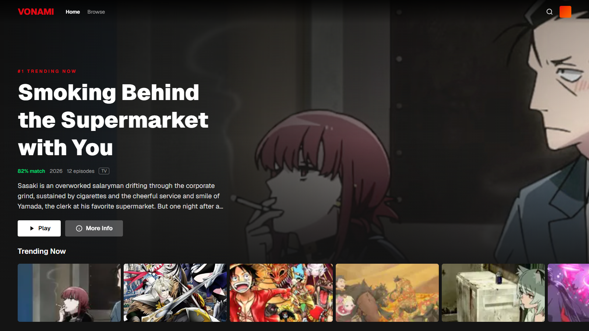
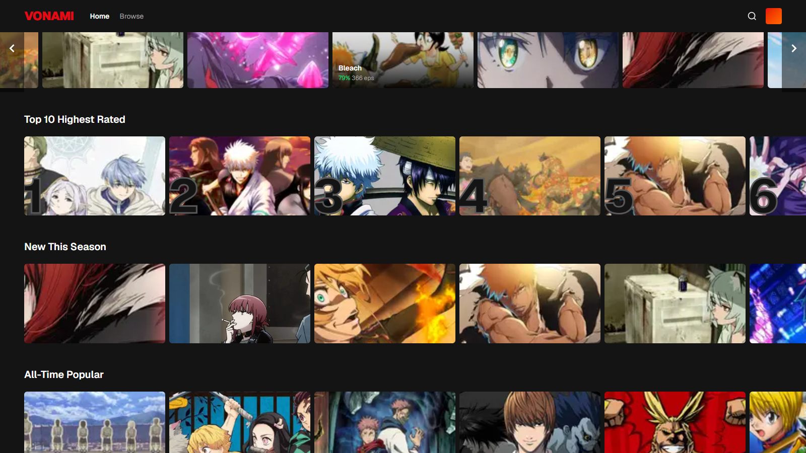
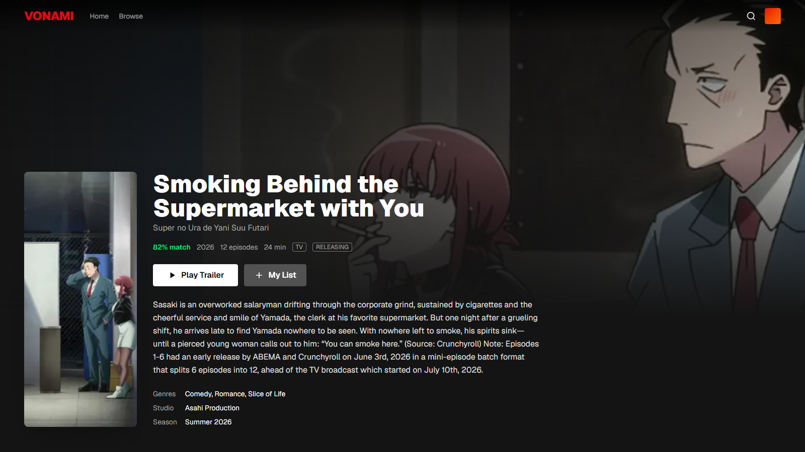
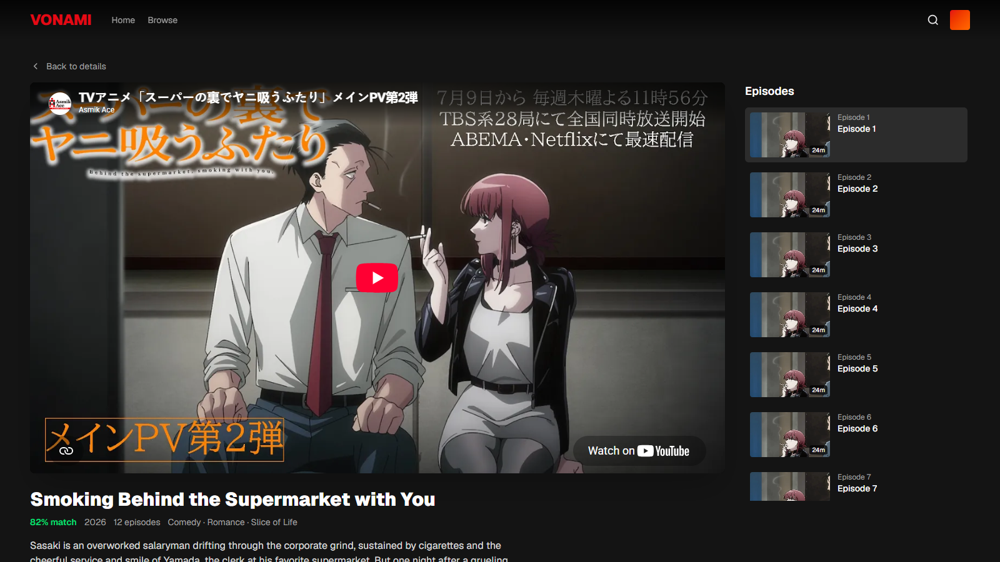
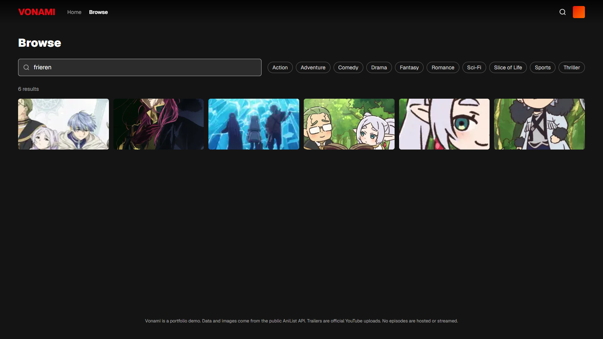

# Vonami

A Netflix-style anime discovery app built with Next.js, Tailwind CSS and GSAP. Browse trending and seasonal anime, open a detail page, watch the official trailer, and search by title or genre. All data comes from the public [AniList](https://anilist.co) GraphQL API.

This is a portfolio demo. It does not host or stream any episodes.

## Screenshots

**Home** with an auto-rotating hero and horizontal rows



**Rows** with a Netflix-style Top 10 and hover previews



**Detail page** with cover, metadata, characters and recommendations



**Watch page** with the official trailer and an episode list



**Browse** with instant search and genre filters



## Features

- Hero banner that cycles through the top 5 trending titles
- Rows for Trending, Top 10, This Season, All-Time Popular and genres
- Detail page with score, episodes, studio, genres, characters and "More Like This"
- Trailer player using the official YouTube upload from AniList
- Search with debounce, genre chips and URL-synced query
- GSAP animations: hero timeline, staggered card reveals on scroll, smooth row scrolling
- Server-side data fetching with hourly revalidation

## Stack

| Layer | Choice |
|---|---|
| Framework | Next.js 16 (App Router, React 19) |
| Styling | Tailwind CSS v4 |
| Animation | GSAP 3 with `@gsap/react` and ScrollTrigger |
| Data | AniList GraphQL API (no API key required) |
| Language | TypeScript |

## Getting started

```bash
npm install
npm run dev
```

Open http://localhost:3000.

For a production build:

```bash
npm run build
npm run start
```

## Project structure

```
src/
  app/
    page.tsx              Home: hero + rows
    anime/[id]/page.tsx   Detail page
    watch/[id]/page.tsx   Trailer player + episode list
    search/               Browse page (client search)
    api/search/route.ts   Search endpoint used by the browse page
  components/
    Navbar.tsx            Fixed top bar, turns solid on scroll
    Hero.tsx              Rotating hero with GSAP timeline
    Row.tsx               Horizontal row with ScrollTrigger reveal
    AnimeCard.tsx         Landscape card with hover overlay
    Reveal.tsx            Generic staggered reveal wrapper
  lib/
    anilist.ts            GraphQL queries and helpers
```

## Credits and disclaimer

- Data and images are provided by the AniList API and belong to their respective owners.
- Trailers are embedded from YouTube.
- The layout is inspired by Netflix. The idea of an anime library app is inspired by [Seanime](https://github.com/5rahim/seanime).
- No media is hosted, cached or distributed by this project.
